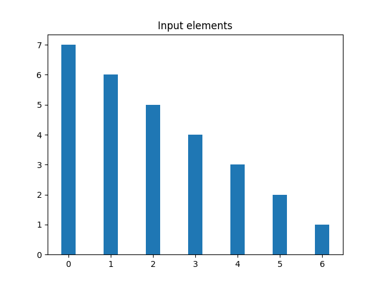
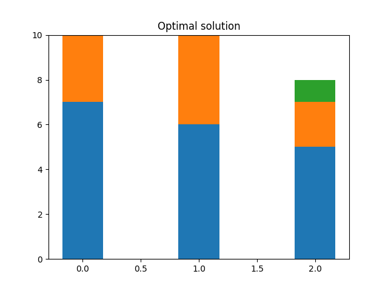

# tal-bin-packing

## Bin packing problem

https://en.wikipedia.org/wiki/Bin_packing_problem

## Implemented algorithms:

- first fit
- last fit
- best fit
- worst fit
- next fit
- optimal solution (next fit for all permutations -> best solution)

## Scripts:

### - `generate_and_pack.py`

```
Bin packing problem solver. Generate data and run chosen algorithms.


positional arguments:
  input          Path to input file

optional arguments:
  -h, --help     show help message and exit
  -v, --verbose  Print info to stdout
```
Data will be generated according to passed input json file.

Example json file content:
```
{
  "bins_capacity": 10,
  "problem_size_from": 1,
  "problem_size_to": 1000,
  "algorithms": ["nf", "ff", "lf", "bf", "wf"],
  "distribution_file": "distrib.txt",
  "type": "elem"
}
```

Script will create following files:
- bin_packing_complexity.png


- bin_packing_memory.png


- output.txt (if `--verbose` was not set)


### - `pack.py`

```
Bin packing problem solver

positional arguments:
  element               Elements

optional arguments:
  -h, --help            show help message and exit
  -a ALGORITHM, --algorithm ALGORITHM
                        Approximation algorithm
  -c capacity, --capacity capacity
                        Bin capacity. Default to 10
  -t, --time            Capture time instead of number of operations
```

Script will visualise results of chosen algorithm and optimal solution in following files:
- elements.png - visualisation of input elements



- approximate_solution.png - visualisation of approximate solution


- optimal_solution.png - visualisation of optimal solution



### Other python files:
- `generator.py` Inverse transform sampling. 

https://en.wikipedia.org/wiki/Inverse_transform_sampling

- `solutions.py` Implemented algorithms
- `solutions_count.py` Algorithms from `solutions.py` with elementary operations count
